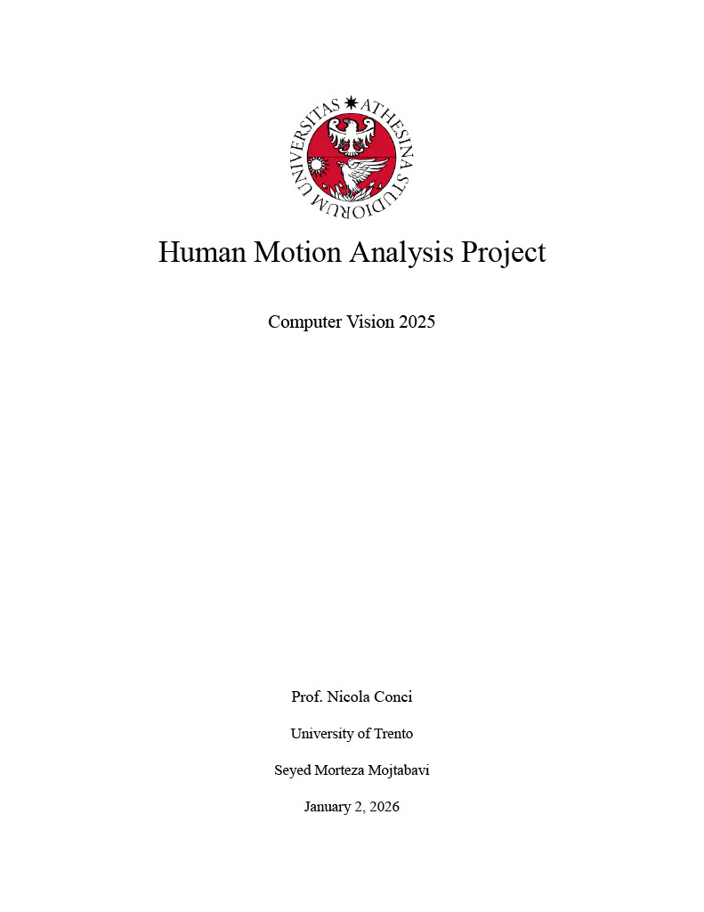
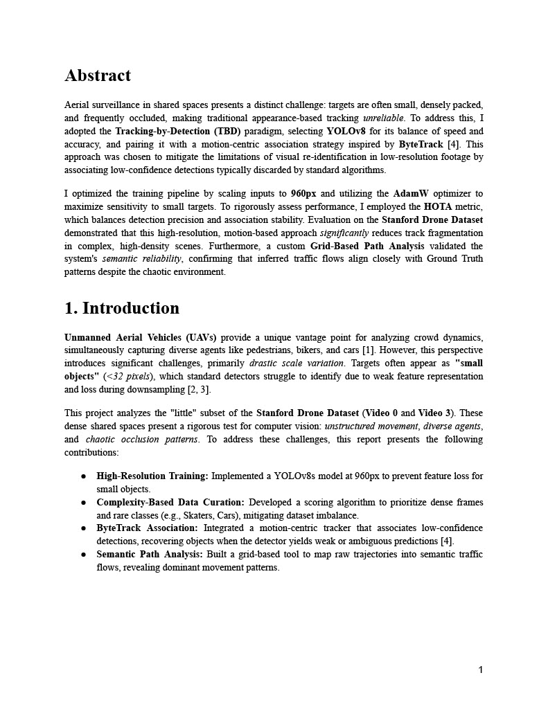

# UAV Object Tracking & Trajectory Analysis Pipeline

## 📄 Report Preview
Below are the opening pages of the detailed technical report for this project.
**[📥 Click here to download the full PDF report](docs/Computer Vision Report.pdf)**

<p align="center">
  
</p>
<p align="center">
  
</p>

## 📌 Project Overview
This project is a computer vision pipeline focused on **Object Tracking**, **Trajectory Analysis**, and **YOLO Model Training** on the Stanford Drone Dataset (SDD). It includes modules for dataset preparation, model training (YOLOv8), custom tracking logic (ByteTrack-based), performance evaluation (HOTA/MSE), and movement pattern analysis (Origin-Destination).

---

## 🏗️ Core Infrastructure (`utils.py`)
This module serves as the backbone for shared constants, file I/O, and visualization helpers.

* **Configuration**:
    * **Display**: Sets a target display height of `960px`.
    * **Classes**: Maps 6 classes (`Pedestrian`, `Biker`, `Car`, `Bus`, `Skater`, `Cart`) to IDs 0-5.
    * **Colors**: Defines specific BGR colors for each class.
* **File I/O**:
    * `get_video_paths()`: Resolves paths for specific scenes ("video0" and "video3").
    * `load_annotations()`: Parses SDD ground truth text files into Pandas DataFrames.
* **Math & Scaling**:
    * `calculate_scaling()`: Computes scaling factors to fit high-res drone video onto the target display size.
    * `bbox_to_yolo()`: Converts absolute bounding boxes to normalized YOLO format (`cx`, `cy`, `w`, `h`).
    * `calculate_mse()`: Computes Mean Squared Error between two trajectory arrays.
* **Visualization**:
    * Contains functions to draw bounding boxes (denormalized), text backgrounds, timestamps, and legends (Class, State, Controls) on OpenCV frames.
* **Dataset Prep Utilities**:
    * `extract_dataset_frames()`: Saves video frames as images.
    * `generate_yolo_labels()`: Matches GT annotations to frames and writes YOLO format `.txt` labels.

---

## 📂 Dataset Management
These scripts handle the conversion of raw video/annotations into a structured dataset for YOLO training.

### `prepare_dataset.py`
Orchestrator script that calls `utils` to extract frames from "video0" and "video3" and generate corresponding YOLO labels.

### `generate_dataset_splits.py`
* **Logic**: Splits the generated dataset into **Train (1000)**, **Val (150)**, and **Test (200)**.
* **Heuristic Selection**: Training frames are not random. They are selected based on a **Complexity Scoring System**:
    * Must contain both `Pedestrian` and `Biker` classes.
    * Must be separated by `MIN_FRAME_GAP` (5 frames).
    * Scored higher if they contain "Rare" classes (`Car`, `Bus`, `Skater`, `Cart`).
* **Output**: Generates `data.yaml` and split text files (`train.txt`, etc.).

---

## 🧠 Model Training & Inference
Modules responsible for training the detector and caching inference results to optimize tracking speed.

### `train_yolo.py`
Trains a YOLOv8s model using the Ultralytics library.
* **Config**: `AdamW` optimizer, Cosine LR, 150 epochs, image size 960.
* **Features**: Includes a custom callback `backup_checkpoint_callback` to save `last.pt` to a persistent directory after every epoch to ensure resume capability.

### `cache_detections.py`
Runs inference on videos using specified models ("new_model" and "old_model").
* **Optimization**: Saves raw detection results (`xyxy`, `score`, `class`) to **Parquet** files. This allows the tracker to run offline without re-running heavy GPU inference.
* **Settings**: Conf threshold 0.25, Agnostic NMS enabled.

---

## 🎯 Object Tracking Engine
The core tracking logic and execution.

### `tracker_utils.py` (The Engine)
* **Classes**:
    * `Track`: Manages state (hits, age, history) and a **Kalman Filter** (Constant Velocity Model).
    * `ByteTrackLike`: A custom tracker implementation inspired by ByteTrack.
* **Key Algorithms**:
    * **2-Stage Matching**: First matches High-Conf detections, then attempts to match Low-Conf detections to remaining tracks.
    * **Revival Logic**: Uses "Future Prediction" (projecting lost tracks forward) to recover tracks that were occluded or missed by the detector.
    * **Gating**: Uses IoU, Euclidean distance, and Mahalanobis distance with adaptive relaxation based on how long a track has been lost.
    * **Class Locking**: Uses a history buffer to stabilize class IDs and prevent flickering.
    * **Metrics**: Implements `eval_hota()` to calculate HOTA, DetA, and AssA scores against GT.

### `tracker.py` (The Driver)
* **Workflow**:
    1.  Loads Video, GT, and Cached Detections (Parquet).
    2.  Runs the `ByteTrackLike` tracker frame-by-frame.
* **Visualizes Real-time**: Shows two windows (GT vs. Tracker).
* **UI**: Draws velocity vectors, trajectory trails, and status (Active/Lost).
* **Controls**: Interactive playback (Pause, Seek, Frame-step).
* **Output**: Exports trajectories to CSV and calculates/saves HOTA metrics.

---

## 📈 Analysis & Post-Processing
Scripts that consume tracking outputs to generate insights.

### `extract_paths.py`
* **Grid System**: Divides the video frame into a **3x3 named grid** (e.g., Top-Left, Middle-Center).
* **Logic**: Maps every point in a trajectory to a region. Compresses the data into a sequence of "Steps" (only recording when a region changes).
* **Input/Output**: Reads Tracker or GT CSVs $\to$ Writes `video{N}_paths{MODEL}.csv`.

### `analyze_path_frequencies.py`
* **Logic**: Reads the extracted path CSVs. Identifies **Origin $\to$ Destination** pairs (e.g., "Top-Left $\to$ Bottom-Right").
* **Aggregation**: Counts frequencies of these paths globally and per-class.
* **Output**: Produces `path_frequency_summary.csv` for statistical reporting.

---

## 🎨 Visualization Tools
Standalone scripts for visual verification.

* **`visualize_ground_truth.py`**: Renders Ground Truth annotations directly onto video frames with playback controls. Useful for verifying raw data integrity.
* **`visualize_dataset.py`**: A sequential viewer for the processed YOLO dataset (`images` folder) to verify image resizing and label correctness.
* **`visualize_dataset_split.py`**: Similar to the above, but visualizes specific splits (train/val/test) defined in `data.yaml`.
* **`compare_trajectories.py`**: A/B Testing Tool: Loads trajectory CSVs from two different models (Old vs. New).
    * **Visual**: Displays the video with both models' trajectories rendered side-by-side (resized to fixed height).
    * **Feature**: Uses unique color shading per Track ID to easily identify ID switching or stability issues.
* **`compare_yolo.py`**: YOLO Model Comparison Tool.
    * **Tri-View**: Shows Ground Truth | Old Model | New Model side-by-side.
    * **Metrics**: Calculates and prints frame-level Precision, Recall, and F1 scores live during playback.

---

## 🔄 Summary of Data Flow
1.  **Raw Data** $\to$ `prepare_dataset.py` $\to$ **YOLO Images/Labels**
2.  **YOLO Images** $\to$ `train_yolo.py` $\to$ **Model Weights (.pt)**
3.  **Video + Model** $\to$ `cache_detections.py` $\to$ **Detections (.parquet)**
4.  **Detections** $\to$ `tracker.py` $\to$ **Trajectories (.csv)**
5.  **Trajectories** $\to$ `extract_paths.py` $\to$ **Regional Paths (.csv)**
6.  **Regional Paths** $\to$ `analyze_path_frequencies.py` $\to$ **Final Stats (.csv)**

---

## 📦 Installation

```bash
# Clone the repository
git clone [https://github.com/MorteZ76/CV_Project](https://github.com/MorteZ76/CV_Project)
cd CV_Project

# Install dependencies
pip install -r requirements.txt
